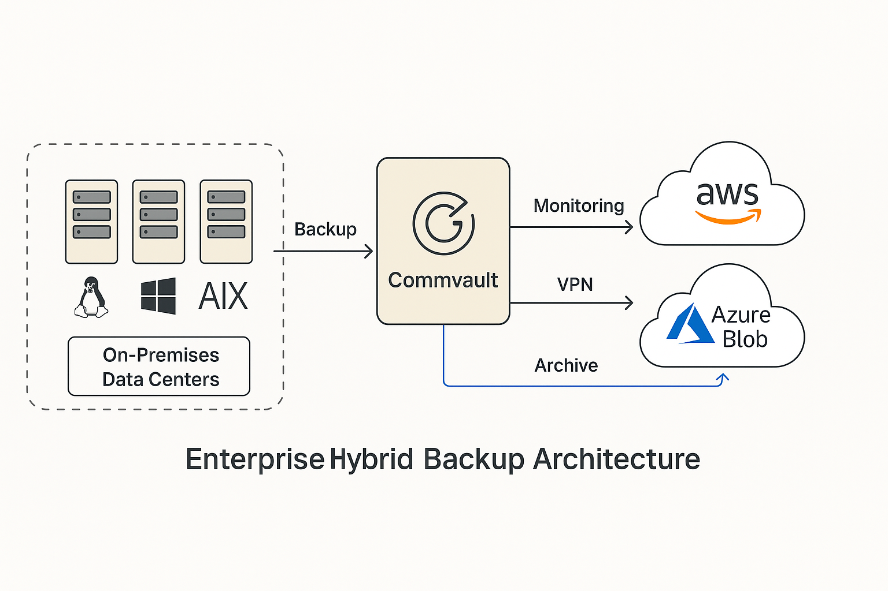

# Enterprise Hybrid Backup Architecture

## 🌍 Overview
This project simulates a hybrid cloud backup solution for large enterprise environments with distributed data centers, legacy systems, and mixed operating systems (AIX, Windows, Linux).

The architecture is inspired by real-world experience in managing and improving backup strategies across complex infrastructures.

## 🧱 Objectives
- Ensure data protection across multiple regions and environments
- Automate agent deployment and monitoring
- Use hybrid cloud to balance cost and retention needs
- Enable long-term archive in Azure/S3 with on-prem fast recovery

## 🧩 Key Components

| Function               | Technology                     |
|------------------------|---------------------------------|
| Backup Engine          | Commvault v11/v12               |
| Cloud Storage          | Azure Blob (Cool) + S3 Glacier |
| Automation             | Ansible for agent deployment    |
| Monitoring             | Grafana via Commvault APIs      |
| OS Coverage            | AIX, Windows, Linux             |

## 🧠 Highlights
- Commvault used for its robust support of legacy OS and hybrid cloud
- Azure Blob for short-term DR; S3 Glacier for long-term archival
- Monitoring via Prometheus + Grafana using Commvault job APIs
- Secure access via site-to-site VPN and RBAC policies

## 🗺️ Diagram

## ⚡ Outcome
- Improved disaster recovery time (RTO) and reliability
- Centralized monitoring of backup jobs and failures
- Cloud-based archival reduces on-prem storage costs

## 📄 Files
- `architecture.md`: Breakdown of architectural decisions
- `use-case.md`: Simulated enterprise context
- `automation-plan.md`: Agent deployment strategy
- `monitoring-strategy.md`: Visibility and alerting
